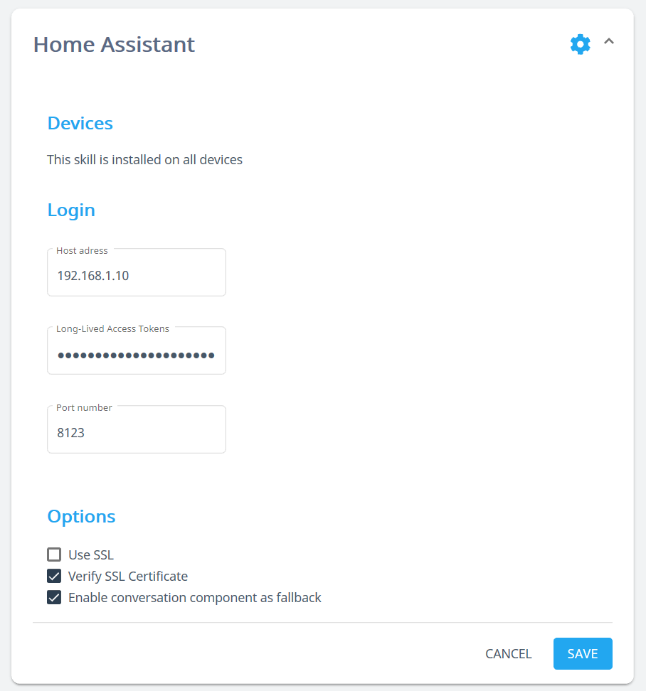
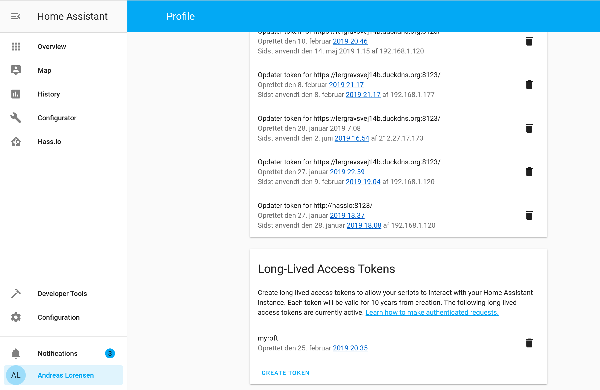

#  Home Assistant
Awaken your home - Control Home Assistant

## About
[Home Assistant](https://www.home-assistant.io/) lets you control all your smart devices in a single easy to use interface. This skill uses the open source Home Assistant's APIs to control devices and entities. Control your lights, garage door, thermostats and more using your voice!

Currently the following entity types are supported: `light`, `switch`, `scene`, `climate`, `groups`, `input_boolean`, `binary_sensor`, `cover` and `camera`

## Examples
* "Turn on office light"
* "Turn off bedroom lights"
* "What is the temperature of thermostat bedroom"
* "Open the living room blinds"
* "Close the garage door"
* "Open Home Assistant"
* "What is the state of power plug bedroom"
* "Has water sensor detected moisture"

## Credits
@BongoEADGC6
@btotharye
Mycroft AI (@mycroftai)

## Category
**IoT**

## Tags
#homeautomation
#iot
#homeassistant
#smarthome


## Configuration
This skill utilizes the skillsettings.json file which allows you to configure this skill via home.mycroft.ai after a few minutes of having the skill installed you should see something like below in the https://home.mycroft.ai/#/skill location:



Fill this out with your appropriate home assistant information and hit save.

You create the Long-Lived Access Token on the user profile page




###  Enabling using the conversation component as Fallback

Home-Assistant [supports basic speech based communication](https://www.home-assistant.io/components/conversation/).
When enabling the setting `Enable conversation component as fallback` on home.mycroft.ai, sentences that were not parsed
by any skill before (based on matching keywords) will be passed to this conversation component at the local Home-Assistant server.
Like this, Mycroft will answer default and custom sentences specified in Home-Assistant.

## Usage

Say something like "Hey Mycroft, turn on living room lights". Currently available commands
are "turn on" and "turn off". Matching to Home Assistant entity names is done by scanning
the HA API and looking for the closest matching friendly name. The matching is fuzzy (thanks
to the `fuzzywuzzy` module) so it should find the right entity most of the time, even if Mycroft
didn't quite get what you said.  I have further expanded this to also look at groups as well as lights.  This way if you say turn on the office light, it will do the group and not just 1 light, this can easily be modified to your preference by just removing group's from the fuzzy logic in the code.


Example Code:
So in the code in this section you can just remove group, etc to your liking for the lighting.  I will eventually set this up as variables you set in your config file soon.

```
def handle_lighting_intent(self, message):
        entity = message.data["Entity"]
        action = message.data["Action"]
        LOGGER.debug("Entity: %s" % entity)
        LOGGER.debug("Action: %s" % action)
        ha_entity = self.ha.find_entity(entity, ['group','light', 'switch', 'scene', 'input_boolean'])
        if ha_entity is None:
            #self.speak("Sorry, I can't find the Home Assistant entity %s" % entity)
            self.speak_dialog('homeassistant.error.device.unknown', data={"dev_name": ha_entity['dev_name']})
            return
        ha_data = {'entity_id': ha_entity['id']}
```

## TODO
 * Script intents processing
 * New intent for locking/unlocking lock entities (with added security?)
 * New intent to handle multimedia/kodi
 * Add feedback to `cover` handling, to check if (for example) the garage door is really closed

## In Development
 * A lot of small stuff

## Contribution
Wanna contribute? Please, check development [README.md](./test/README.md)
