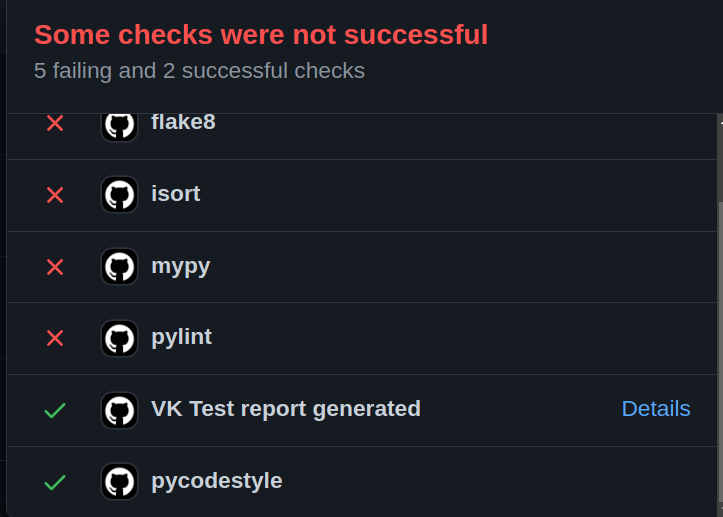
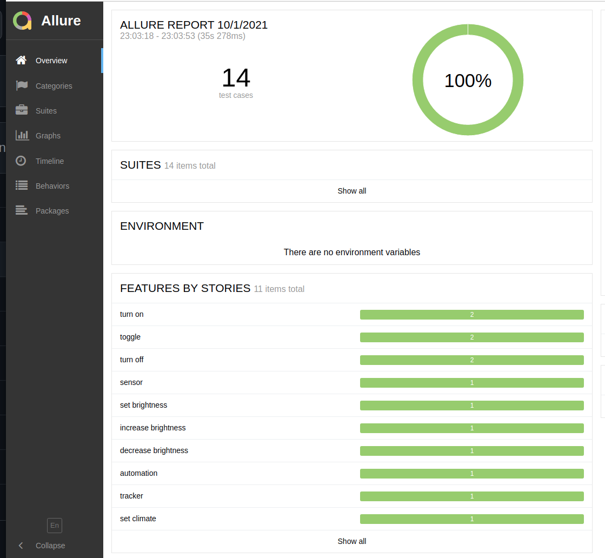
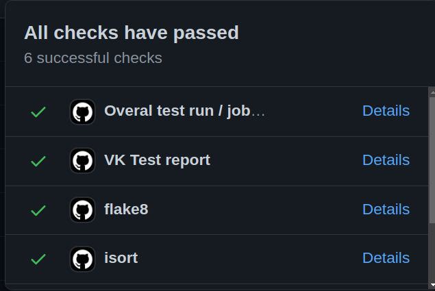

#  Home Assistant
Awaken your home - Control Home Assistant

## About
[Home Assistant](https://www.home-assistant.io/) skill include [Voight Kampff tests](https://mycroft-ai.gitbook.io/docs/skill-development/voight-kampff).
To achieve a same development environment is needed to add a specific "dummy/testing" components to your running HA installation.
When test is run, then skill behave is tested along side with communication between Mycroft <> HA and also HA actions to each utterance.

## HA Configuration - configuration.yaml
[configuration.yaml](ci/HA/configuration.yaml) contain all necessary dummy entities in HA.

## HA Configuration - automation.yaml
[automations.yaml](ci/HA/automations.yaml) contain dummy automations entities in HA.

*Note: Put automation into automation.yaml only when your configuration.yaml contain `automation: !include automations.yaml` otherwise put it directly into `configuration.yaml`.*

## HA Configuration - .storage
[.storage](ci/HA/.storage) contain copy of dummy instance of HA configuration database for use with CI.
If created new, long live token must be newly generated before copying .storage there so the token is stored also in it.

## Usage - offline usage
Whole testing can be used offline.
- Apply configurations from above.
- Add new login access token to your HA.
- Apply token to `settings.json` in home assistant skill or online at [home.mycroft.ai](home.mycroft.ai).
- Check if skill communicate with HA
- Install hass virtual from [twrecked/hass-virtual](https://github.com/twrecked/hass-virtual)
- Run these commands:
```
mycroft-skill-testrunner vktest  clear
mycroft-skill-testrunner vktest -t homeassistant.mycroftai
```
More informations about VK tests at [mycroft-ai.gitbook.io](https://mycroft-ai.gitbook.io/docs/skill-development/voight-kampff/test-runner)

*Note: Before each run, is better to restart HA and check if all dummy/test values/states are in initial position.*

## Usage - online usage aka Github Actions
Enable [Github pages](https://guides.github.com/features/pages/) and Github Actions for your repo.

In settings of your fork, set publish dir to branch `gh-pages` as `/root`. Allure reports then will be accessible from [https://*YOUR_NAME*.github.io/skill-homeassistant/](https://mycroftai.github.io/skill-homeassistant/)

Workflow will pull latest Mycroft-core from git and Home assistant ver. 2021.9 from pip.
Directory `test/ci/HA` contain Home Assistant configuration with Long live action token, token is set inside [workflow](.github/workflows/build.yaml) as `HASS_TOKEN`.

Overall result will look like this:
# 

*Note: VK TEST report state show if an allure report was generated, not if it was successful. You have to click on details, it will redirect you to corresponding allure test so You can check it.*

# 

Workflow should run on both, Commits and PRs. Biggest advantage of Github Actions is that anybody can run it in their fork so tests can be performed in development stage before sending PR.

### Development
#### Home Assistant
Directory `test/ci/HA/` contain `configuration.yaml`, `automations.yaml` and `.storage` where are settings for HA.
These can be downloaded and supplied to Your local HA instance so tests can be run locally.

USR: `mycroft`
PASS: `mycroft`

*Note: Use these accounts only for development as password and token is public.*

#### VK Tests
With VK Tests, not only Mycroft responding is tested. Workflow contain settings for Home Assistant and is pulled a run inside docker so Mycroft must connect to it. Thankfully, this everything run inside GitHub Actions, so real public instance is no longer needed.

For each test, new virtual entity is set in HA configuration. This way we can check Mycroft response, but also communication wit HA.
```
light:
  # 06_turn_on_light.feature
  - platform: virtual
    name: "!Mycroft light"
    initial_value: 'off'
```
See [twrecked/hass-virtual](https://github.com/twrecked/hass-virtual), it's well written, so adding new entity type is possible.

Inside allure report, tests are ini `behave` suite.

#### Unittests
Unittests contain some basic function tests, most of them works with mock library. In past whole tests needed public HA instance that is no longer available.
For now only `test_light_nossl()` need running test HA instance, but configuration made for github actions can be used.

Tests in allure report are under `unittest` suite.

#### Mycroft logs
When something goes wrong with vk tests or unittests , we also publish Mycroft logs from run to github pages. They are accessible by `Details` as others tests.

#### Linters
As we run all tests and linters in one job to save time to set mycroft and HA for each of them, their status would be merged and shown only as overall test result. To get a linter output, we would have to search in whole log of job.

To overcome that, each Linter is run separate and it's state is stored as outcome by it's name/id to later usage.
```
    # Linters - pylint
    - name: pylint
      if: always()
      id: pylint
      run: |
        source $MYCROFT_VENV
        pylint .
```
For now we use:
 - flake8
 - isort
 - pycodestyle
 - pylint

All linters have been set to allow `maximum line size: 127` to match GitHub editor. To get maximum checks from linters, run them inside Mycroft-core virtual environment. That way, check are more accurate.

Example:
```
# inside skill folder
mycroft-pip install flake8 isort pycodestyle pylint
source /path_to_mycroft/.venv/bin/activate

isort .
flake8 --max-line-length=127 .
pycodestyle --max-line-length=127 .
pylint .

# Run linters repeatedly until you manage to fix all errors.
```

#### Linters - Show state
To make it a little convenient, we publish status of each linter by code below. It show OK/NOK status as result.
```
- name: State - pylint
      if: always()
      uses: Sibz/github-status-action@v1
      with:
        authToken: ${{ secrets.GITHUB_TOKEN }}
        context: 'pylint'
        state: ${{ steps.pylint.outcome }}
        sha: ${{github.event.pull_request.head.sha || github.sha}}
        target_url: https://github.com/${{ github.repository }}/runs/${{ env.LOG_ID }}#step:${{ steps.linters_status.outputs.pylint }}:1
```
To make it little more convenient, status of linter can be expanded of direct link to its position in log by `target_url:`.

To construct url to log, we have to use a GitHub API and ge ID of log and number of each linter.
No special access is needed and url is created dynamically so it works alo on Forks.
Log ID is get by job name (`GITHUB_JOB`) and run id (`GITHUB_RUN_ID`). With that log is accessible by `Details` in each Linter status.

*Note: This mus run, before sending Linters status.*
```
    # Get id for accessing logs
    - name: Get step id for accessing step status logs
      id: linters_status
      if: always()
      run: |
        JOBS=$(curl -H "Accept: application/vnd.github.v3+json" ${GITHUB_API_URL}/repos/${GITHUB_REPOSITORY}/actions/runs/${GITHUB_RUN_ID}/jobs | jq -r '.jobs')
        for row in $(echo "${JOBS}" | jq -r '.[] | @base64'); do
            _jq() {
              echo "${row}" | base64 --decode | jq -r ${1}
            }
            if [ $(echo "$( _jq '.name')") = "${GITHUB_JOB}" ]; then
              echo "LOG_ID=$(_jq '.id')" >> $GITHUB_ENV
              for step in $(echo "$(_jq '.steps')" | jq -r '.[] | @base64'); do
                _jqs() {
                echo "${step}" | base64 --decode | jq -r ${1}
              }
              echo "::set-output name=$(_jqs '.name')::$(_jqs '.number')"
              echo "$(_jqs '.name'):$(_jqs '.number')"
              done
            fi
        done
```
Final status looks like this:
# 

#### Contribution
Want to contribute? That's great and we appreciate it.
To make a code clean and maintainable, use above linters and if possible, use also GitHub actions and GitHub Pages.

If your change is bigger, try to slice it into few commits so code changes are readable and easier to review.

Wanna speed up your development? Try Visual Studio Code with Andlo’s Remote Debug Skill https://github.com/andlo/remote-debug-skill.git.
Extensions like Code Spell Checker, Markdown Preview Enhanced and Remote - SSH helps a lot.

Also `git commit --amend` and `git rebase -i HEAD~2` helps a lot, but before use, check their documentation.